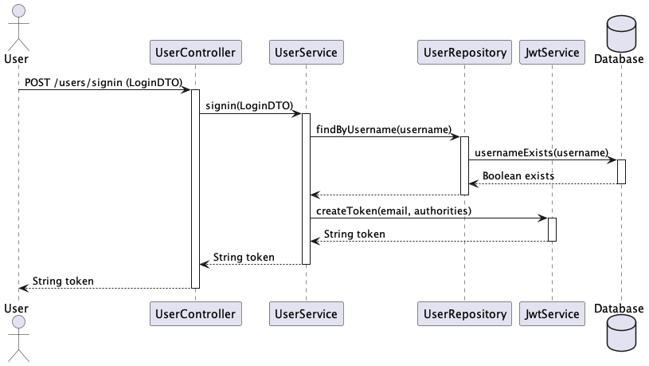

# SuperHeroes App
Servicio API RESTful de creación de superheroes.

## Tech Stack
- Java 11
- Spring Boot 2 
- Base de Datos H2

## Diagrama de secuencia del sign in


## Base de Datos
- Inicializada automáticamente via Flyway.
- Credenciales:
  - url: jdbc:h2:mem:superheroesdb
  - user: admin
  - password: admin
- API h2
  - http://localhost:9000/h2-console
  - ```select * from superheroes;```

## Ejecutar la aplicación
```
mvn spring-boot:run
```

## Ejecutar con Docker
```
docker-compose up -d
```

## Swagger
- http://localhost:9000/swagger-ui/index.html
- Link útil para utilizar JWT tokens con Swagger: https://www.baeldung.com/openapi-jwt-authentication

## Curl
```
curl --location 'http://localhost:9000/users/signin' \
--header 'Content-Type: application/json' \
--data '{
    "username": "admin",
    "password": "letmein"
}'
```